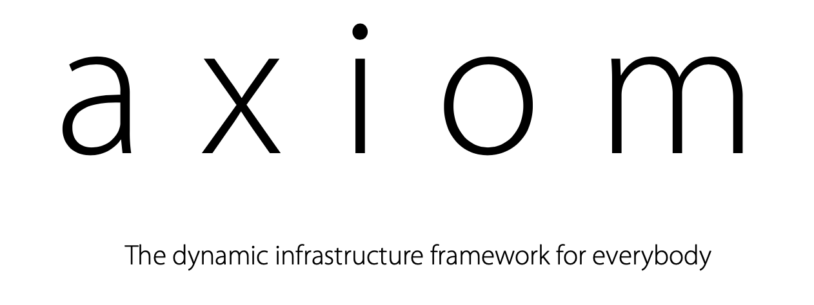

<h1 align="center">
  </a>
  <br>
</h1>

[](https://opensource.org/licenses/MIT)
[](https://github.com/pry0cc/axiom/issues)
[](https://twitter.com/pry0cc)

<p align="center">
<a href="https://github.com/pry0cc/axiom/wiki" target="_blank"> </a>
</p>

**Axiom is a dynamic infrastructure framework** to efficiently work with multi-cloud environments, build and deploy repeatable infrastructure focussed on offensive and defensive security. 

Axiom works by pre-installing your tools of choice onto a 'base image', and then using that image to deploy fresh instances. From there, you can connect and instantly gain access to many tools useful for both bug hunters and pentesters. With the power of immutable infrastructure, most of which is done for you, you can just spin up 15 boxes, perform a distributed nmap/ffuf/screenshotting scan, and then shut them down.  

Because you can create many disposable instances very easily, axiom allows you to distribute scans of many different tools including dnsgen dnsx ffuf gau gowitness httpx masscan massdns nmap nuclei shuffledns & subfinder. Once installed and setup, you can distribute a scan of a large set of targets across 10-15 instances within minutes and get results extremely quickly. This is called [axiom-scan](https://github.com/pry0cc/axiom/wiki/Scans).

Axiom supports several cloud providers, eventually, axiom should be completely cloud agnostic allowing unified control of a wide variety of different cloud environments with ease. Currently, DigitalOcean, IBM Cloud, & Linode are officially supported providers. Google Compute is partially implemented. AWS & Azure are on the roadmap. If you would like prioritization of a feature or provider implementation, please contact me @pry0cc on Twitter and we can discuss :)

## Resources

-   [Introduction](https://github.com/pry0cc/axiom/wiki)
-   [Troubleshooting & FAQ](https://github.com/pry0cc/axiom/wiki/0-Installation#troubleshooting)
-   [Quickstart](https://github.com/pry0cc/axiom/wiki/A-Quickstart-Guide)
    - [Fleets](https://github.com/pry0cc/axiom/wiki/Fleets)
    - [Scans](https://github.com/pry0cc/axiom/wiki/Scans)
-   [Demo](#demo)
-   [Story](https://github.com/pry0cc/axiom/wiki/The-Story)
-   [Installation Instructions](https://github.com/pry0cc/axiom/wiki/0-Installation)
    -   [Easy Install](#installation)
    -   [Manual Install](https://github.com/pry0cc/axiom/wiki/0-Installation#Manual)
-   [Scan Modules](https://github.com/pry0cc/axiom/wiki/Scans#example-axiom-scan-modules)
-   [Contributors](#contributors)

## $100 Free Credit

The original and best supported provider for Axiom is Digital Ocean! If you're signing up for a new Digital Ocean account, [please use my link!](https://m.do.co/c/bd80643300bd) 

<p align="center">
<a href="https://m.do.co/c/bd80643300bd" target="_blank"> </a></p>
  
## Linode $20 Free Credit
Our third provider for axiom! Please use [this link](https://www.linode.com/?r=23ac507c0943da0c44ce1950fc7e41217802df90) for $20 free credit on Linode :) 


## Installation

You will also need to install the newest versions of all packages `sudo apt dist-upgrade` and curl, which is not installed by default on Ubuntu 20.04, if you get a "command not found" error, run `sudo apt update && sudo apt install curl`.
<br>
<br> Run the following curl command, as your standard user, not as root.

```
bash <(curl -s https://raw.githubusercontent.com/pry0cc/axiom/master/interact/axiom-configure)
```

If you have any problems with this installer, please refer to [Installation](https://github.com/pry0cc/axiom/wiki/0-Installation).

## Demo
In this demo (sped up out of respect for your time ;) ), we show how easy it is to initialize and ssh into a new instance.


## Support
If you like Axiom and it saves you time, money or just brings you happy feelings, please show your support through sponsorship! Click the little sponsor button in the header and sponsor for as little as $1 per month :)

Or buy me a coffee to keep me powered :)

<a href="https://www.buymeacoffee.com/pry0cc" target="_blank"></a>

## Sponsored By SecurityTrails!

We are lucky enough to be sponsored by the awesome SecurityTrails! Sign up for your free account <a href="https://securitytrails.com/app/signup?utm_source=axiom">here!</a>

---

# Operating Systems Supported
| OS         | Supported | Tested        |  
|------------|-----------|---------------|
| Ubuntu     |    Yes    | Ubuntu 20.04  |
| Kali       |    Yes    | Kali 2020.4   |
| MacOS      |    Yes    | MacOS 10.15   |
| Arch Linux |    Yes    |     Yes       | 
| Windows    | Partially | WSL w/ Ubuntu |


# Contributors
We've had some really fantastic additions to axiom, great feedback through issues, and perseverence through our heavy beta phase!

A list of all contributors can be found [here](https://github.com/pry0cc/axiom/graphs/contributors), thank you all!

## Logo
The logo was made by our amazing [s0md3v](https://twitter.com/s0md3v)! Thank you for making axiom look sleek as hell! Really beats my homegrown logo :)

# Packages To Date

- [x]  amass
- [x]  anew
- [x]  anti-burl
- [x]  aquatone
- [x]  assetfinder
- [x]  dalfox
- [x]  dirb
- [x]  dnsprobe
- [x]  dnsvalidator
- [x]  docker
- [x]  fbrobe
- [x]  ffuf
- [x]  gau
- [x]  getjs
- [x]  gf
- [x]  gobuster
- [x]  Golang (setup, path configured, latest version)
- [x]  gowitness
- [x]  hakrawler
- [x]  httprobe
- [x]  jq
- [x]  kxss
- [x]  masscan
- [x]  massdns
- [x]  metasploit
- [x]  mosh
- [x]  nmap
- [x]  oh-my-zsh
- [x]  openvpn
- [x]  projectdiscovery chaos
- [x]  projectdiscovery chaos-client
- [x]  projectdiscovery httpx
- [x]  projectdiscovery nuclei
- [x]  projectdiscovery shuffledns
- [x]  proxychains w/ Tor setup
- [x]  SecLists
- [x]  sn0int
- [x]  SQLMap
- [x]  subfinder
- [x]  subgen
- [x]  subjack
- [x]  tmux
- [x]  urlprobe
- [x]  waybackurls
- [x]  zdns
- [x]  zmap

And many more! Do you want to add a package to axiom? [Let me know!](https://github.com/pry0cc/axiom/issues)
